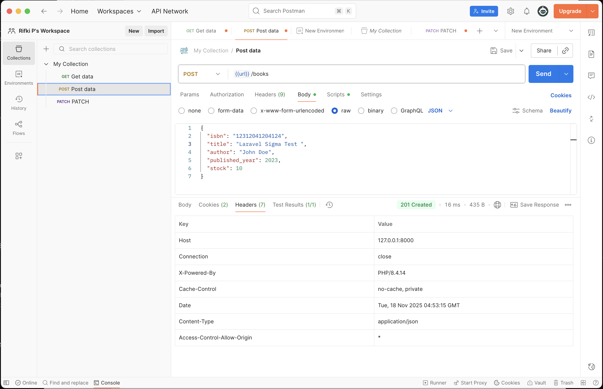
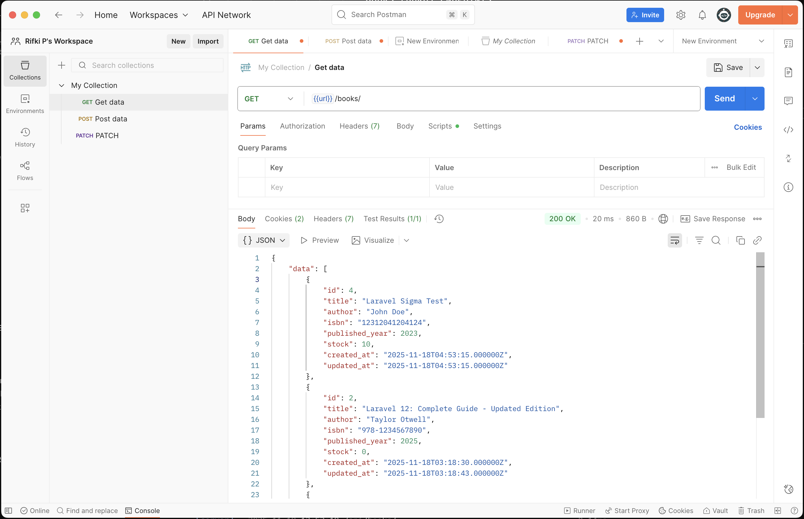
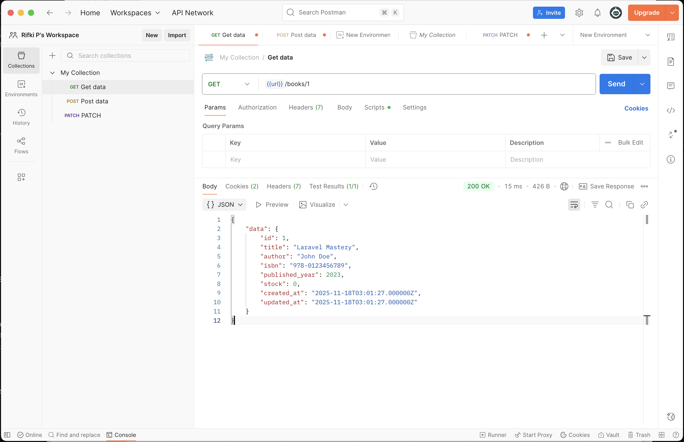
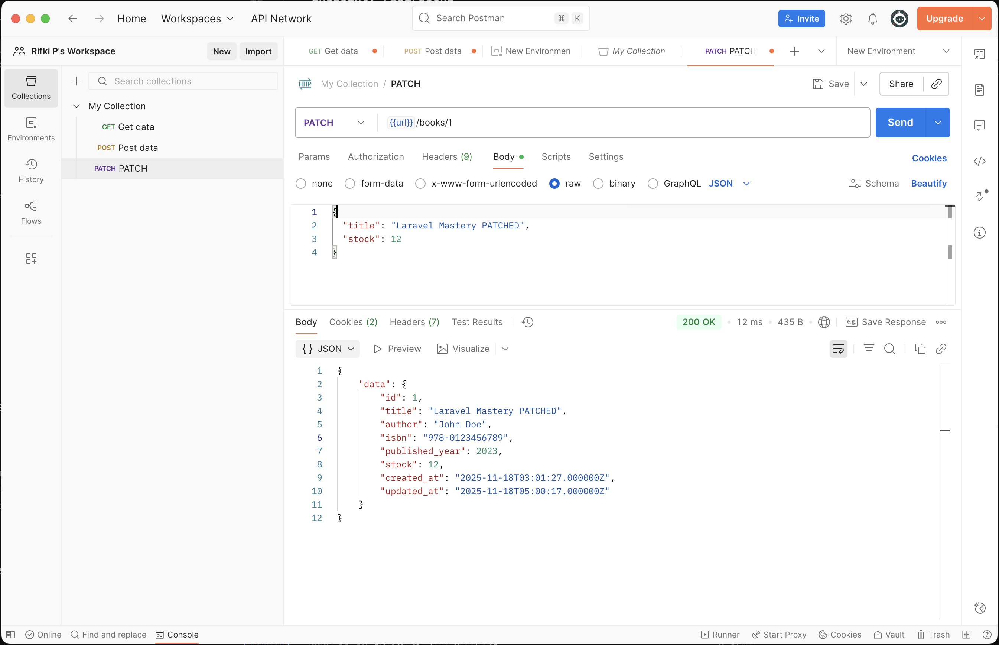
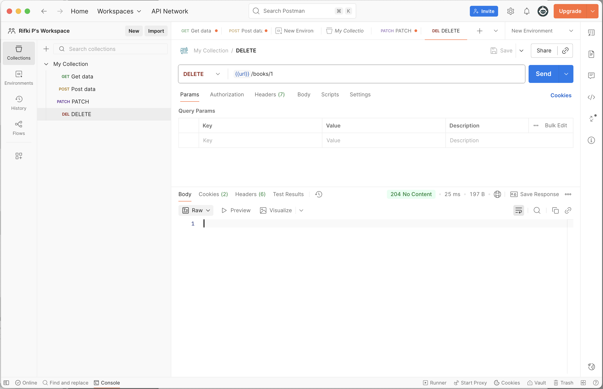
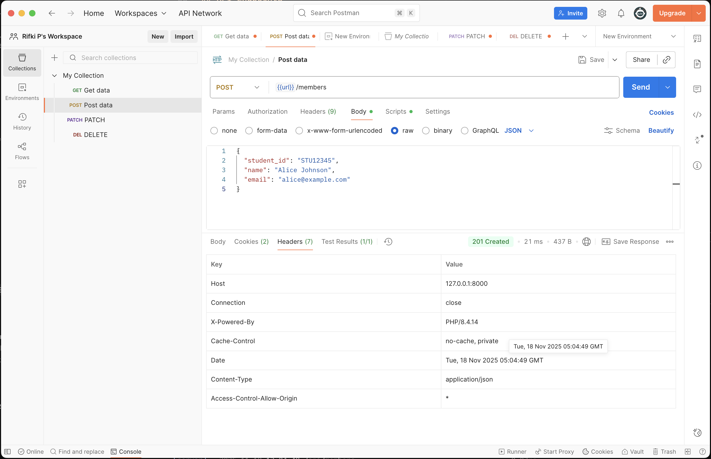
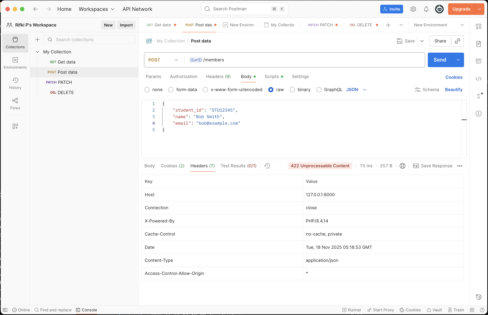
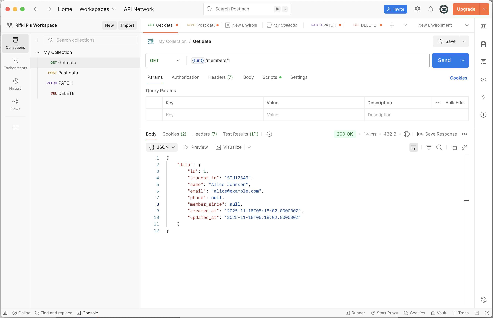
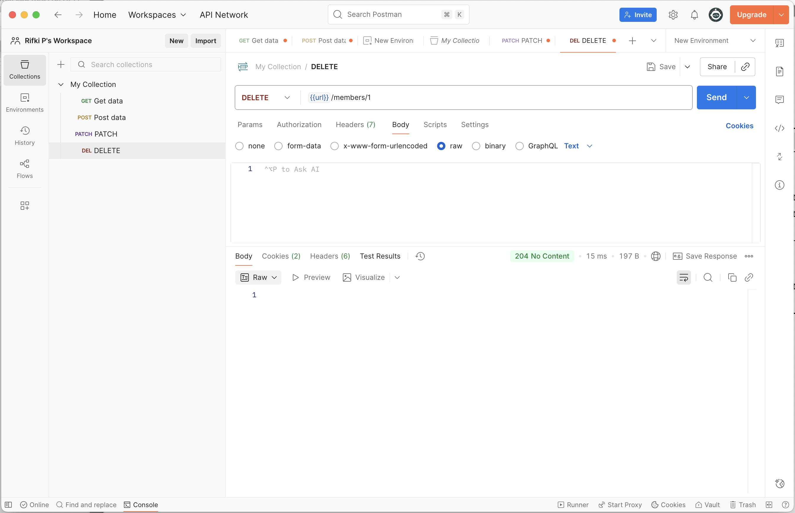

# API Testing Screenshots

This document contains Postman test results for all API endpoints.

---

## Books Endpoints

### 1. POST /api/books - Create Book (201 Created)



**Expected Response:**
- Status: `201 Created`
- Returns book data with generated ID

---

### 2. GET /api/books - List All Books (200 OK)



**Expected Response:**
- Status: `200 OK`
- Returns array of all books

---

### 3. GET /api/books/1 - Get Specific Book (200 OK / 404 Not Found)



**Expected Response:**
- Status: `200 OK` if book exists
- Status: `404 Not Found` if book doesn't exist

---

### 4. PATCH /api/books/1 - Update Book (200 OK / 404 Not Found)



**Expected Response:**
- Status: `200 OK` if book exists and updated
- Status: `404 Not Found` if book doesn't exist

---

### 5. DELETE /api/books/1 - Delete Book (204 No Content)



**Expected Response:**
- Status: `204 No Content`
- Empty response body

---

## Members Endpoints

### 1. POST /api/members - Create Member (201 Created)



**Expected Response:**
- Status: `201 Created`
- Returns member data with generated ID

---

### 2. POST /api/members - Duplicate Student ID (422 Unprocessable)



**Expected Response:**
- Status: `422 Unprocessable Entity`
- Returns validation error message

```json
{
  "message": "This student ID is already registered",
  "errors": {
    "student_id": [
      "This student ID is already registered"
    ]
  }
}
```

---

### 3. GET /api/members/1 - Get Specific Member (200 OK / 404 Not Found)



**Expected Response:**
- Status: `200 OK` if member exists
- Status: `404 Not Found` if member doesn't exist

---

### 4. DELETE /api/members/1 - Delete Member (204 No Content)



**Expected Response:**
- Status: `204 No Content`
- Empty response body

---

## Notes

- All API endpoints automatically return JSON responses
- Validation errors return `422 Unprocessable Entity` with detailed error messages
- Not found resources return `404 Not Found`
- Successful deletions return `204 No Content`
